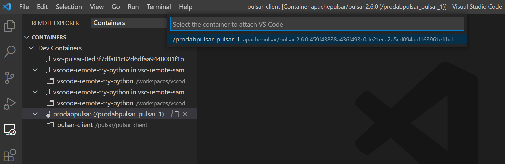
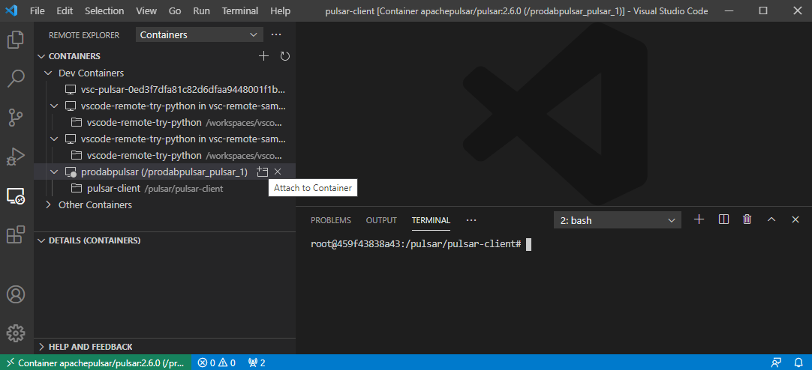

# How to [develop inside a Docker container](https://code.visualstudio.com/docs/remote/containers)

The pulsar-client is not supported in Windows 10 anymore. It can be used in Linux, MacOS or others. To develop with the [Pulsar Python client](https://pulsar.apache.org/docs/en/client-libraries-python/) under Windows, you can create a Docker container.


## Install Visual Studio Code extensions

Install the [Visual Studio Code Remote Development](https://marketplace.visualstudio.com/items?itemName=ms-vscode-remote.vscode-remote-extensionpack) extension.


## Start pulsar Docker image

**use run command:** 
- `docker run -it -p 6650:6650 -p 8080:8080 --name pulsar apachepulsar/pulsar:2.6.0 bin/pulsar standalone`

**or docker-compose:**
- Go into the folder of your *docker-compose.yml* file.
- To get to the PowerShell: hold SHIFT key and then right click and select *Open PowerShell window here*.
- Then the PowerShell opens and you can use the command `docker-compose up` to start the container.


## Use VS Code to connect to the container

1. To [attach to a Docker container](https://code.visualstudio.com/docs/remote/attach-container) ...
- ... select **Remote-Containers: Attach to Running Container...** from the Command Palette (F1), then you have to select the container to attach VS Code. 



	or 
	
- ... use the **Remote Explorer** in the Activity Bar and from the **Containers** view, select the **Attach to Container** inline action on the container you want to connect to.


2. Start terminal and test Python environment.
- `python3 --version`
- `pip --version`


## Install the `pulsar-client` library

Install using pip: `pip install pulsar-client==2.6.0`


## Get it running

1. Create folder: `mkdir /pulsar-client && cd /pulsar-client`
2. Create file called `consumer.py` 
3. Create file called `producer.py` 
4. Refresh view in VS Code 
5. Open `consumer.py` file + Copy and paste [this](consumer.py) code
```python
consumer = client.subscribe('my-topic', 'my-subscription')
while True:
    msg = consumer.receive()
    try:
        print("Received message '{}' id='{}'".format(msg.data(), msg.message_id()))
        # Acknowledge successful processing of the message
        consumer.acknowledge(msg)
    except:
        # Message failed to be processed
        consumer.negative_acknowledge(msg)
client.close()
```
6. Open `producer.py` file + Copy and paste [this](producer.py) code
```python
import pulsar
client = pulsar.Client('pulsar://localhost:6650')
producer = client.create_producer('my-topic')
for i in range(10):
    producer.send(('Hello-%d' % i).encode('utf-8'))
client.close()
```
7. Open the terminal
8. Use the command `python consumer.py` to run the Python script
9. Use the command `python producer.py` to run the Python script 

